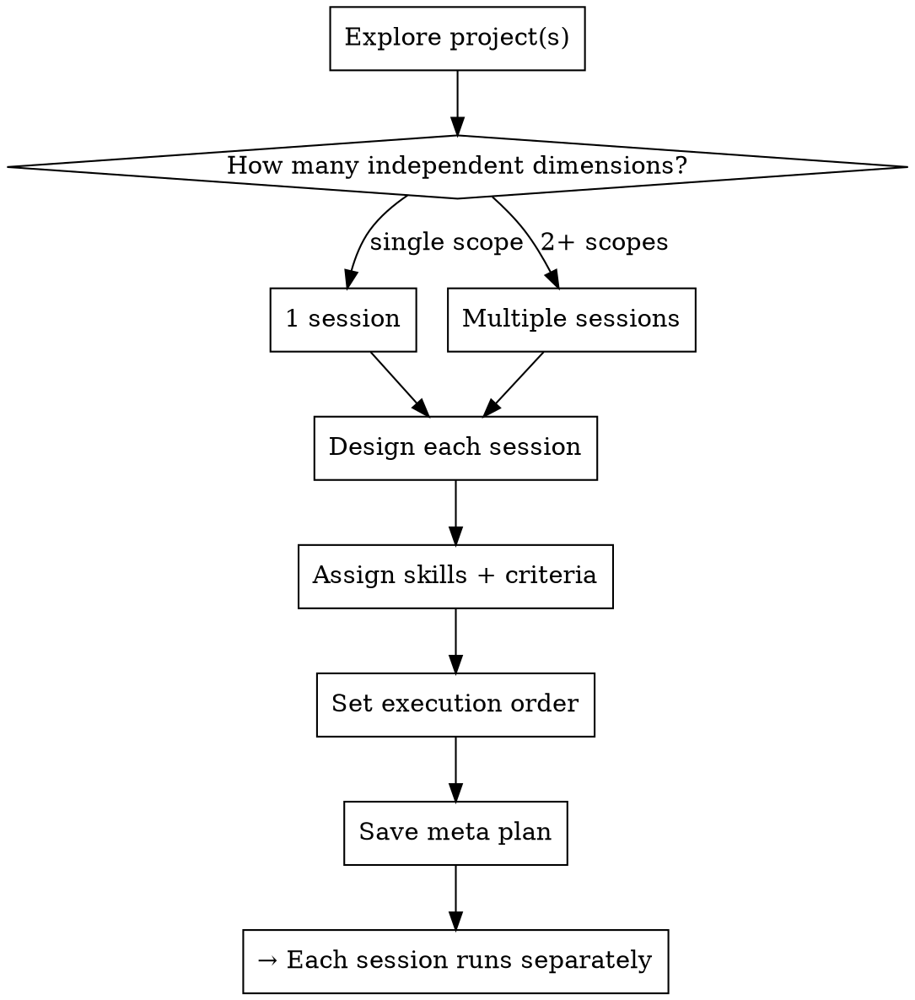

# Meta Review Plan

## Overview

Produces a structured plan of **review sessions** for any project or ecosystem. Each session describes *how to conduct the review* — not what problems to fix. Findings from reviews feed separate implementation plans.

**Core principle:** Plan the review before the review. Each session is a discrete scope with specific lenses, ordered skills, and completion criteria. Findings come after — not before — the review.

**Announce at start:** "Using meta-review-plan skill to design the review session structure."

## The Iron Law

```
NO IMPLEMENTATION TASKS IN THE META PLAN.
THE META PLAN DESCRIBES REVIEWS, NOT FIXES.
```

Problems found during reviews go into separate `writing-plans` sessions — never into the meta plan itself.

## Checklist

Use TodoWrite to create a todo for each item.

1. **Explore project structure** — spawn Explore agents in parallel (one per project/subsystem)
2. **Identify review dimensions** — map perspectives relevant to this ecosystem
3. **Design review sessions** — one session per independent dimension
4. **Specify skill sequence** for each session
5. **Define completion criteria** for each session
6. **Set execution order** — which sessions are parallel, which are sequential
7. **Save meta plan** to `docs/plans/YYYY-MM-DD-review-sessions-metaplan.md`

## Process Flow



## Phase 1: Explore (Parallel Agents)

Spawn one Explore agent per independent subsystem. All in a single message.

**Each Explore agent prompt must include:**
- Exact directories to read
- What structural info to extract (files, layers, tech stack, git log, docs)
- Output format: factual inventory, no opinions

**Scale:**
- 1 project → 1-2 agents (by layer: frontend / backend)
- Ecosystem (3+ projects) → 1 agent per project
- Max 4 agents in one parallel dispatch

## Phase 2: Identify Review Dimensions

After exploration, pick the review dimensions relevant to *this* project. Standard dimensions:

| Dimension | Lens | Best For |
|-----------|------|----------|
| **Product / Customer** | Does it deliver value to end users? | Customer-facing products |
| **UI/UX** | Where does the interface create friction? | Frontend-heavy apps |
| **Architecture** | How do components fit together? Coupling, duplication, risks | Multi-project ecosystems |
| **Code Quality** | Dead code, tech debt, test gaps | Any codebase |
| **Data Flow** | How data moves through the system, where it's lost | Pipeline / ETL systems |
| **Security** | Auth, injection, secrets, exposure | Public-facing services |
| **Operations** | Workers, queues, failure modes, monitoring | Celery/job-based systems |

Not every project needs all dimensions. Choose the ones that matter for this ecosystem.

## Phase 3: Design Each Review Session

Each session document must contain exactly these sections:

```markdown
## REVIEW SESSION N — [Dimension Name] (глазами [perspective])

**Цель:** One sentence — what question this review answers.

### На что смотреть
- Specific files, directories, modules, endpoints to examine
- Specific questions to answer (not problems to find)

### Инструменты ревью
1. **`skill-name`** — invoke FIRST, reason why first
2. **`skill-name`** — invoke AFTER step 1, what it adds
3. **`skill-name`** — invoke at end, what it verifies

### Критерии завершения ревью
- [ ] Measurable, binary checkboxes
- [ ] Each criterion produces a concrete artifact or verdict
- [ ] All user stories / flows rated PASS/PARTIAL/FAIL with evidence

### Выход
One sentence: what artifact the session produces and where it's saved.
```

## Phase 4: Skill Assignment Rules

Assign skills to sessions using this table:

| Review Goal | First Skill | Supporting Skills |
|-------------|-------------|-------------------|
| Real user behavior | `webapp-testing` | `customer-value-audit` |
| Frontend quality | `frontend-design` (audit mode) | `webapp-testing` |
| Code cleanup | `simplify` | `requesting-code-review` |
| Architecture risks | `requesting-code-review` | `codex-review` |
| Data pipeline | `pipeline-runner` | `systematic-debugging` |
| Dead code / debt | `simplify` | `codex-review` |
| Security | `requesting-code-review` | `codex-review` |
| Worker reliability | `systematic-debugging` | `codex-review` |

**Rule:** `webapp-testing` (Playwright) always runs FIRST for any session touching a running UI.
**Rule:** `codex-review` always runs LAST as independent second opinion on critical findings.

## Phase 5: Execution Order

```
Sessions with NO dependencies → run in parallel
Sessions that NEED prior findings → run sequentially after dependencies
```

Standard order for most ecosystems:
```
Layer 1 (parallel): Product/UX + Architecture
Layer 2 (parallel): Code Quality + Data Flow
Layer 3 (sequential): Security (needs architecture knowledge)
Layer 4: Operations (needs everything above)
```

## After Each Review Session Completes

1. Save findings to `docs/reviews/YYYY-MM-DD-review-{dimension}.md`
2. Invoke `brainstorming` for each cluster of findings
3. Invoke `writing-plans` → implementation plan per cluster
4. Only then: `executing-plans` / `subagent-driven-development`

**Never start implementation without a completed review for that scope.**

## Meta Plan Output Format

Save to `docs/plans/YYYY-MM-DD-review-sessions-metaplan.md`:

```markdown
# [Project] — Мета-план ревью-сессий
# Дата: YYYY-MM-DD

> Это план ревью-сессий. Каждый блок описывает КАК проводить ревью.
> Конкретные задачи появятся как результат каждого ревью.

## Контекст проекта
[3-5 строк: что это, стек, масштаб]

## РЕВЬЮ-СЕССИЯ 1 — [Dimension]
[session template from Phase 3]

## РЕВЬЮ-СЕССИЯ 2 — [Dimension]
[...]

## Порядок выполнения
[Execution order diagram]

## Обязательные Playwright точки
[List of URLs and flows to verify]
```

## Common Mistakes

| Mistake | Correct approach |
|---------|-----------------|
| Listing tasks to fix in the meta plan | Meta plan = how to review, not what to fix |
| One giant review session for everything | One session per independent dimension |
| Skipping Playwright for UI sessions | Always run Playwright first for any UI scope |
| "I already know the problems" | The review discovers problems — don't pre-populate |
| Skipping exploration phase | Exploration grounds session design in reality |
| Assigning too many skills to one session | Max 3 skills per session, ordered clearly |
| Parallel sessions with shared state | Only parallelize sessions that read independently |
