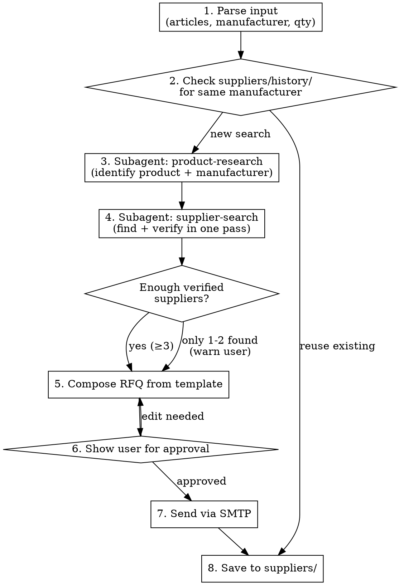

# Supplier Search & RFQ

Automated B2B supplier discovery and RFQ dispatch for Relion technika s.r.o.

**Core principle:** Search from specific to general. Stop when enough suppliers found. Verify inline, not as separate pass.

## Workflow



## Step 1: Parse Input

User provides products via screenshot, text, or table. Extract:

| Field | Required | Example |
|-------|----------|---------|
| Article/part number | Yes | AE73700I51 |
| Product name | If no article | Fuse, 800VDC 700A |
| Manufacturer | Yes (may be approximate) | Adler |
| Quantity | Yes | 590 pcs |
| Region | No (default: EU) | EU / worldwide |

## Step 2: Check History

```bash
ls ~/Desktop/ClaudeCoding/tdcompass.ru/suppliers/history/
```

If manufacturer was searched before, read the file — reuse verified suppliers. Skip to Step 5.

## Step 3: Product Research (Subagent)

Dispatch subagent using `product-research-prompt.md`. This identifies:
- Exact manufacturer (full legal name, country, website)
- Product specs and series
- Category keywords for supplier search

**Budget:** max 10 WebSearch + 5 WebFetch.

## Step 4: Supplier Search + Verification (Subagent)

Dispatch subagent using `supplier-finder-prompt.md`. Runs in parallel with Step 3 if manufacturer is already known.

**Search priority:**
1. Manufacturer website → distributor/partner page
2. WebSearch: `"{article}" distributor`
3. WebSearch: `"{manufacturer}" authorized distributor Europe`
4. B2B directories (see `known_sources.json`)
5. WebSearch: `"{category}" supplier EU`

**Inline verification** (for each candidate):
- WebFetch website → confirm it loads
- Find email/phone on Contact or Impressum page
- Confirm manufacturer/brand is in their catalog

**Stop criteria:**
- Found 5 verified suppliers → STOP immediately
- Exhausted all strategies, found 3-4 → that's OK, proceed
- Found only 1-2 → warn user, ask if proceed or expand search
- Found 0 → report to user, suggest manufacturer direct contact

**Budget:** max 15 WebSearch + 15 WebFetch total. NOT per supplier.

## Step 5: Compose RFQ

Read template:
```
~/Desktop/ClaudeCoding/tdcompass.ru/suppliers/rfq_template_en.txt
```

Fill placeholders:
- `{MANUFACTURER}` — full manufacturer name
- `{CATEGORY}` — product category in English
- `{ITEMS_LIST}` — numbered list: `1. {name} — {article} — {qty} pcs;`
- `{DEADLINE}` — 7 days from today (format: DD-MM-YYYY)

Append verified supplier table at bottom of email.

## Step 6: User Approval

**ALWAYS show the composed email and supplier list to the user before sending.**

Ask:
- Send to test address or to suppliers directly?
- Any edits to the email?
- Remove/add any suppliers?

**NEVER send to real suppliers without explicit user confirmation.**

## Step 7: Send via SMTP

```python
import smtplib
from email.mime.text import MIMEText
from email.mime.multipart import MIMEMultipart

# Config from known_sources.json → email_config
smtp_host = 'mail.relion.cz'
smtp_port = 587
email_from = 'procurement@relion.cz'
# Password: read from environment or ask user
```

App password is NOT stored in the skill. Ask user or read from env.

## Step 8: Save Results

Save to `~/Desktop/ClaudeCoding/tdcompass.ru/suppliers/`:
- `{manufacturer_slug}_{date}_suppliers.md` — full results with contacts
- `history/{manufacturer_slug}.json` — for reuse in future searches

History JSON format:
```json
{
  "manufacturer": "ADLER Elektrotechnik Leipzig GmbH",
  "searched": "2026-03-24",
  "region": "EU",
  "suppliers": [
    {
      "name": "ENERTRONIC SA",
      "country": "ES",
      "email": "info@enertronic.es",
      "phone": "+34 917 218 519",
      "web": "https://enertronic.es",
      "type": "distributor",
      "verified": true
    }
  ]
}
```

## Token Budget

| Phase | Max tokens | Max tool uses |
|-------|-----------|---------------|
| Product research subagent | 15k | 15 |
| Supplier search subagent | 30k | 30 |
| Compose + send + save | 5k | 5 |
| **Total target** | **~50k** | **~50** |

If product research agent has not completed in 15 tool uses — stop and return what you have.
If supplier search agent has not found enough in 30 tool uses — stop, report findings.

## Known Search Sources

Read `~/Desktop/ClaudeCoding/tdcompass.ru/suppliers/known_sources.json` for:
- Category-specific directories (electrical, chemicals, mechanical)
- Search query templates
- Email configuration

## Common Mistakes

| Mistake | Fix |
|---------|-----|
| Searching for replacement when one supplier is wrong region | Include region filter in initial search prompt |
| Running verification as separate pass | Verify inline during search |
| Continuing search after finding enough | STOP at target count |
| Sending email without user approval | ALWAYS confirm first |
| Storing password in results files | Never save credentials |
| Assuming 5 suppliers always findable | 3 is fine for niche products |

## Red Flags — STOP

- Agent is on 20+ WebSearch calls and still searching → stop, report what's found
- Same company appearing in results under different names → deduplicate
- Found only non-EU suppliers when EU was requested → ask user to expand region
- Email bounce or SMTP error → report to user, don't retry blindly
